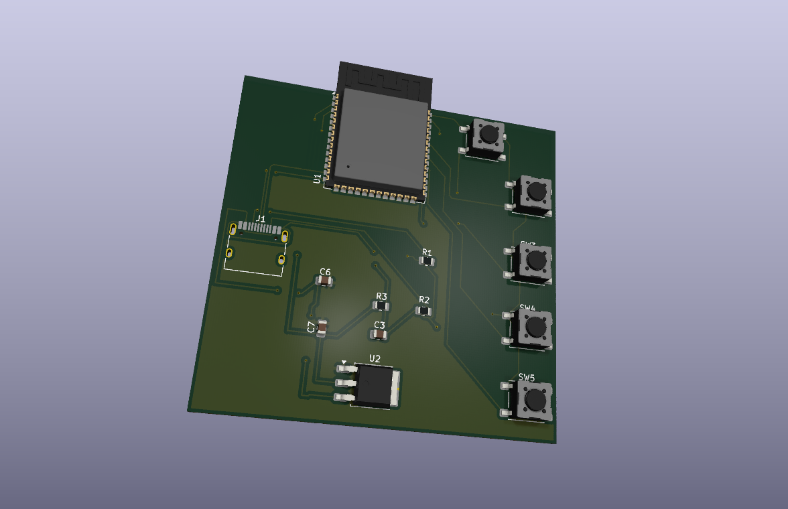
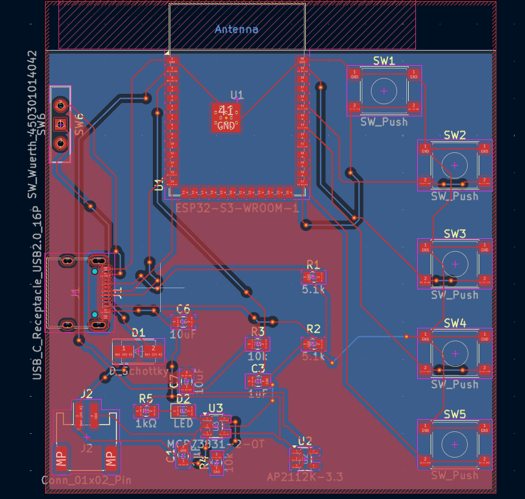
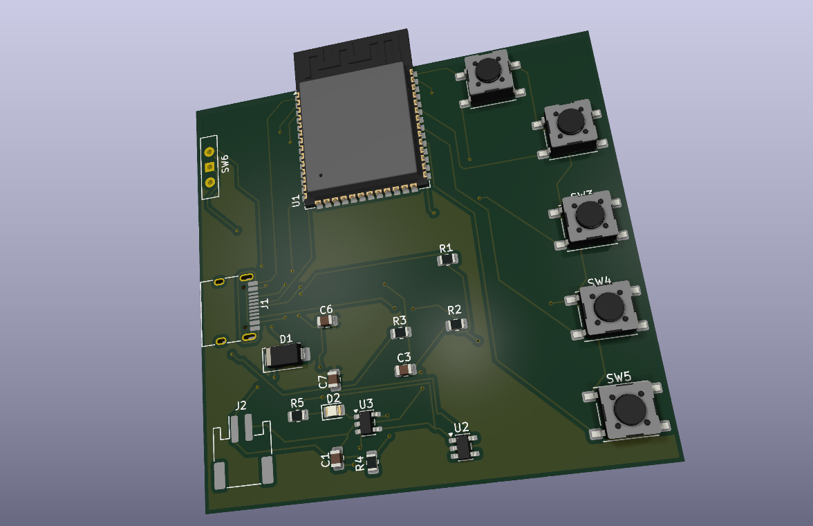
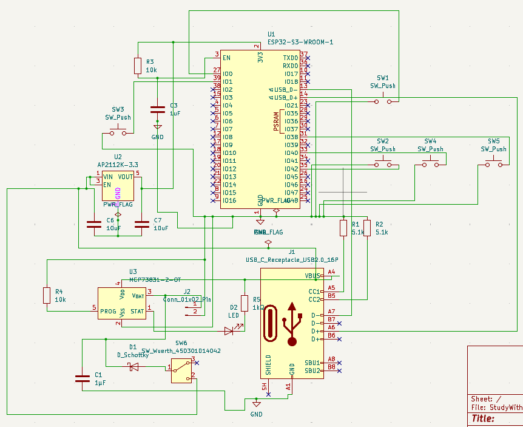

# Custom PCB

## Initial PCB prototype

### Hardware Architecture

| Top-Down PCB Layout | 3D Board Preview | Schematic View
| :---: | :---: | :---: |
|  |  | 

### Board Specifications
* **Processor:** ESP32-S3-WROOM-1 (Dual-Core Xtensa LX7 + ULP RISC-V Coprocessor)
* **Power Rail:** USB-C (5V) $\rightarrow$ AMS1117-3.3 LDO (3.3V rail with 10µF bulk filtering)
* **Input Matrix:** 5x Tactile Switches (Direct-mapped to RTC GPIOs for low-power deep-sleep wakeups)
* **PCB Constraints:** 2-layer FR-4, 1.6mm board thickness, 1 oz Cu, 0.3mm min via holes

## PCB Prototype 2

| Top-Down PCB Layout | 3D Board Preview | Schematic View
| :---: | :---: | :---: |
|  |  | 

## What changed from Prototype 1
- Custom KiCad schematic + PCB, built around the ESP32-S3-WROOM-1
- USB-C for power/data, with correct CC1/CC2 pull-down resistors for
  UFP detection
- LiPo battery support: MCP73831 charge management, diode-OR'd battery
  feed, and a physical power switch, so the device can run untethered
- 5 macro buttons + a BOOT/download-mode button
- Status LED for charge state

## Design decisions
This section exists because most of the interesting engineering here
was in catching and fixing problems before ordering, not in the first draft.

**Battery power-path safety.** The first version of the power switch
tied the battery directly onto the same net as USB VBUS. That's fine
when only one source is present, but if the device is switched on
*and* plugged into USB simultaneously, USB would backfeed straight
into the battery with no current limiting — a real overcharge/fire
risk once this is something other people are using, not just me.
Fixed with a Schottky diode (SS14) in series with the battery feed,
so current can only flow battery → system, never the reverse.

**Regulator selection.** The original 3.3V regulator (AMS1117) has a
~1.2V dropout — fine for 5V-in USB-only designs, but a single-cell
LiPo spends most of its discharge curve below the ~4.3V that regulator
needs for a clean output. Swapped to the AP2112K-3.3, which has a much
lower dropout (~250mV) and is a proven choice for exactly this LiPo +
USB use case (same part Adafruit uses on their Feather boards).

**Verification process.** Every schematic and PCB revision was checked
with KiCad's ERC/DRC before moving forward, including tracing net
connectivity directly (KiCad's Net Navigator / Highlight Net) rather
than trusting visual inspection alone on a dense schematic — caught
several issues this way that weren't obvious from the drawing (a
reversed status LED wired against the STAT pin's sink-only behaviour,
an isolated ground pour island under the button footprints, and a
button-footprint mixup introduced during a component-shortage
substitution, caught before the gerbers were finalized).

## Status
Schematic and PCB layout complete, DRC clean. Ordered and assembled
via JLCPCB (small first batch). Boards shipped — bring-up and firmware
not yet started.

## Files
- `kicad/` — full KiCad project (schematic + PCB layout)
- `docs/` — BOM, schematic PDF export, gerbers
- `enclosure/` — parametric CadQuery case (see its own README for design notes)
