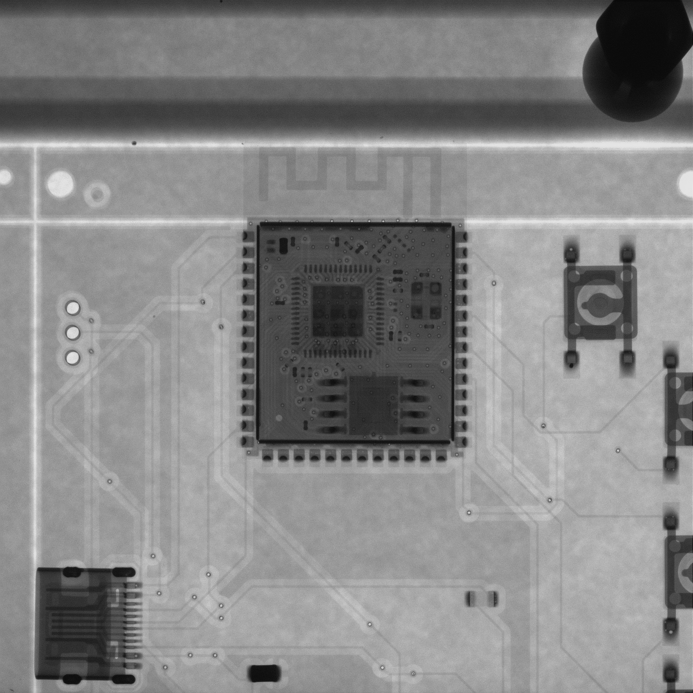

# Physical Product

| Xray | Physical PCB | Problem
| :---: | :---: | :---: |
|  |  | 

When the boards arrived, I attempted to flash my firmware, however each time I did so, it got stuck on "waiting for download"

So I tested with my multimeter. The conclusions from this were that GPIO0 from pin 27 was physically shorted to the ground. Hence the
chip was stuck in boot mode constantly.
I managed to find the culprit. The resistance of pin 27 was around 0.3 Ohms when the board was powered, however when the switch was pressed 
this didn't change. That was when I came to the realisation that I had made a complete oversight in the design of my PCB.

I had connected the same sides of the buttons to the ground and to the chip, without knowing which orientation the button was going to be in.
This meant that every single button on the board was shorted to the ground. 

I didn't let this large setback get me down, I grabbed my soldering iron, and physically re-soldered the buttons on the board in an aim to 
prove that my firmware worked. After re-soldering, my firmware flashed successfully and I ended up with a temperamental, but working product.

Sadly, the journey ends here for now; however, I have learnt many valuable lessons with my first hardware build - most importantly, do not wire 
a switch on the same sides.

| Testing | Soldering
| :---: | :---: |
|  | 
