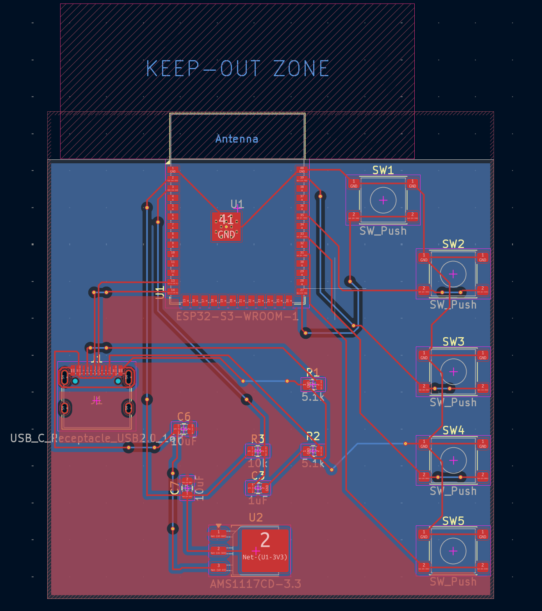
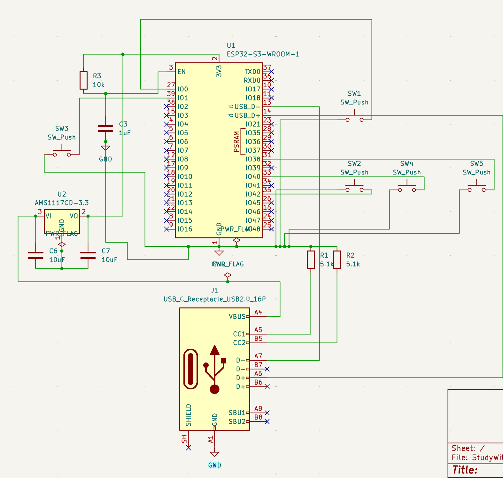

# StudyWithKey
StudyWithKey is firmware for a microcontroller which controls a bluetooth remote designed for use on quizlet 

## Hardware Architecture

| Top-Down PCB Layout | 3D Board Preview | Schematic View
| :---: | :---: | :---: |
|  |  | 

### Board Specifications
* **Processor:** ESP32-S3-WROOM-1 (Dual-Core Xtensa LX7 + ULP RISC-V Coprocessor)
* **Power Rail:** USB-C (5V) $\rightarrow$ AMS1117-3.3 LDO (3.3V rail with 10µF bulk filtering)
* **Input Matrix:** 5x Tactile Switches (Direct-mapped to RTC GPIOs for low-power deep-sleep wakeups)
* **PCB Constraints:** 2-layer FR-4, 1.6mm board thickness, 1 oz Cu, 0.3mm min via holes
